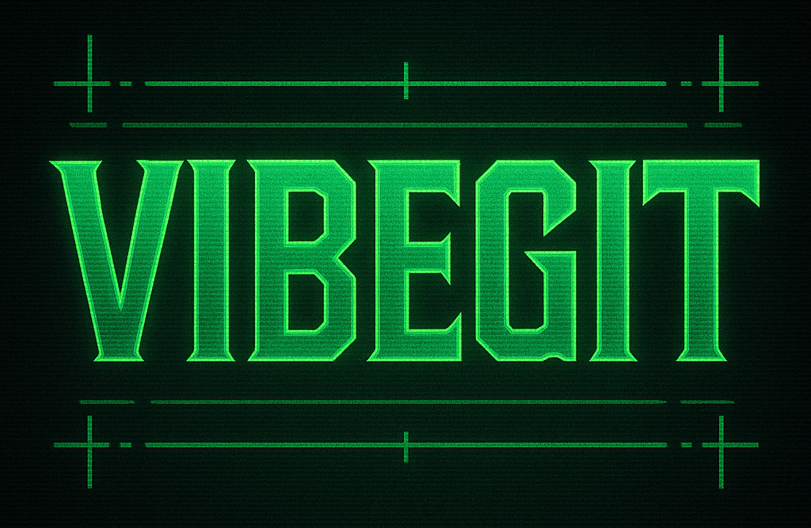

# vibegit

Become 10x more productive by orchestrating multiple AI coding agents in isolated, sandboxed git environments.

[](https://oclif.io)
[](https://npmjs.org/package/vibegit)
[](https://npmjs.org/package/vibegit)
[](https://github.com/pushpak1300/vibegit/LICENSE)

vibegit is a CLI tool that empowers developers to orchestrate multiple AI coding agents working simultaneously on different aspects of a project. By creating isolated git environments for each agent, vibegit enables parallel development without conflicts, allowing you to harness the full potential of AI-assisted coding at scale.

## Why vibegit for Multi-Agent Coding?

Working with multiple AI coding agents presents unique challenges:

- **Environment Isolation**: Each AI agent needs its own clean workspace to avoid conflicts
- **Context Management**: Agents need access to relevant code without confusion
- **Coordination**: Orchestrating multiple agents requires a centralized control mechanism
- **Integration**: Combining work from multiple agents can be complex
- **Workflow Management**: Tracking what each agent is doing becomes difficult at scale

vibegit solves these problems through its innovative approach to multi-agent development.

## Installation

```sh
npm install -g vibegit
```

## Usage

```sh
$ vibegit COMMAND
```

## Commands

### `vibegit new SESSION`

Create a new sandbox environment from the current repo.

```
USAGE
  $ vibegit new SESSION [--force]

ARGUMENTS
  SESSION  Name of the session/branch

FLAGS
  -f, --force  Skip checks and force creation if target directory exists

EXAMPLES
  $ vibegit new experiment-feature
  $ vibegit new bugfix-123 --force
  $ vibegit new new-idea
```

### `vibegit list`

List all vibegit sessions.

```
USAGE
  $ vibegit list [--verbose]

FLAGS
  -v, --verbose  Show additional details for each session

EXAMPLES
  $ vibegit list
  $ vibegit list --verbose
```

### `vibegit go SESSION`

Output command to navigate to a vibegit session directory.

```
USAGE
  $ vibegit go SESSION [--no-hint]

ARGUMENTS
  SESSION  Name of the session to go to

FLAGS
  --no-hint  Suppress usage hints

EXAMPLES
  $ vibegit go feature-branch
  $ eval "$(vibegit go feature-branch)"
```

Pro tip: Add this to your shell profile for convenient navigation:
```
function vg() { eval "$(vibegit go $1)"; }
```

### `vibegit push [SESSION]`

Push code changes to remote repository.

```
USAGE
  $ vibegit push [SESSION] [--all] [--force]

ARGUMENTS
  SESSION  Name of the session to push

FLAGS
  --all       Push all sessions to their respective branches
  -f, --force  Force push (git push -f)

EXAMPLES
  $ vibegit push
  $ vibegit push --all
  $ vibegit push experiment-feature
  $ vibegit push experiment-feature --force
```

### `vibegit remove [SESSION]`

Remove a vibegit session or all sessions.

```
USAGE
  $ vibegit remove [SESSION] [--all] [--force] [--push]

ARGUMENTS
  SESSION  Name of the session to remove

FLAGS
  --all     Remove all sessions
  -f, --force  Skip confirmation prompt
  --push    Push the repository before removing the session

EXAMPLES
  $ vibegit remove experiment-feature
  $ vibegit remove --all
  $ vibegit remove bugfix-123 --push
```

### `vibegit help [COMMAND]`

Display help for vibegit.

```
USAGE
  $ vibegit help [COMMAND...] [-n]

ARGUMENTS
  COMMAND...  Command to show help for.

FLAGS
  -n, --nested-commands  Include all nested commands in the output.

DESCRIPTION
  Display help for vibegit.
```

### `vibegit mcp-server`

Start an MCP (Mission Control Protocol) server that exposes vibegit commands as tools for AI agents.

```
USAGE
  $ vibegit mcp-server [--port <value>]

FLAGS
  -p, --port=<value>  [default: 3333] Port to run MCP server on

EXAMPLES
  $ vibegit mcp-server
  $ vibegit mcp-server --port 3000
```

## MCP Server for AI Agents

The vibegit CLI includes a Mission Control Protocol (MCP) server that allows AI agents to interact with vibegit functionality via API endpoints. This enables automation and integration with other tools.

### API Endpoints

The MCP server exposes RESTful API endpoints for all vibegit operations:

- `GET /`: Lists available tools and endpoints
- `POST /list-tools`: Lists all available vibegit commands as tools
- `POST /call-tool`: Executes a specific vibegit command
- `POST /close`: Shuts down the MCP server

All tools exposed by the MCP server can be accessed programmatically, enabling AI agents to interact with vibegit sessions.

### Example Usage

```bash
# Start the MCP server
$ vibegit mcp-server

# In a separate terminal or application, you can interact with the API
# For example, using curl to list available tools:
$ curl -X POST http://localhost:3333/list-tools
```

## Workflow Example

```sh
# Create a new session for a feature
$ vibegit new awesome-feature

# Navigate to the session
$ eval "$(vibegit go awesome-feature)"
# Or if you've added the suggested function to your shell profile:
$ vg awesome-feature

# Make your changes...

# Push your changes to the remote
$ vibegit push

# Clean up when you're done
$ vibegit remove awesome-feature --push
```

## License

MIT